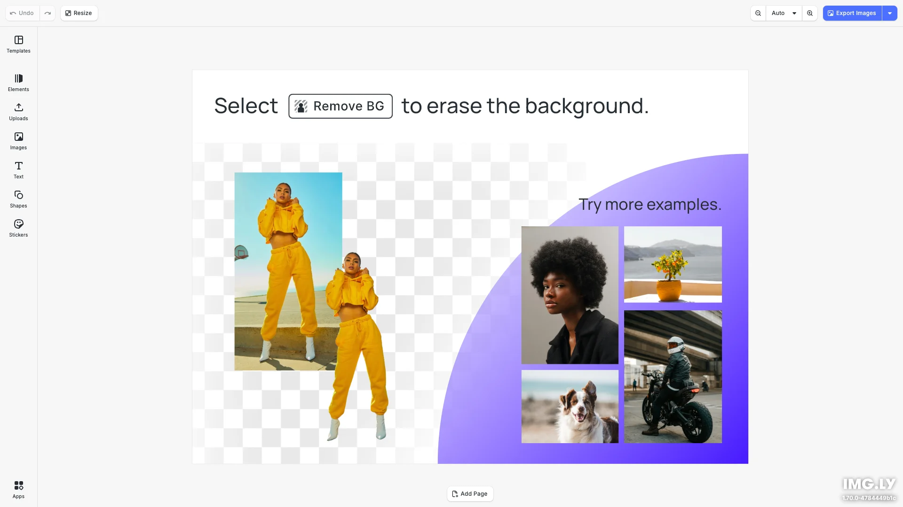

# Background Removal Editor Starter Kit

Create stunning graphics with AI-powered background removal. Select any image to instantly remove its background with a single click. Built with [CE.SDK](https://img.ly/creative-sdk) by [IMG.LY](https://img.ly), runs entirely in the browser with no server dependencies.

<p>
  <a href="https://img.ly/docs/cesdk/js/plugins/background-removal/">Documentation</a> |
  <a href="https://img.ly/showcases/cesdk">Live Demo</a>
</p>



## Features

- **AI Background Removal** - Remove backgrounds from images with one click:
  - **Canvas Menu**: Right-click on an image and select "Remove Background"
  - **Apps Panel**: Click the "Apps" button in the dock to access background removal
- **Text Editing** - Typography with fonts, styles, and effects
- **Image Placement** - Add, crop, and arrange images
- **Shapes & Graphics** - Vector shapes and design elements
- **Export** - PNG, JPEG, PDF with quality controls

## Getting Started

### Clone the Repository

```bash
git clone https://github.com/imgly/starterkit-background-removal-editor-ts-web.git
cd starterkit-background-removal-editor-ts-web
```

### Install Dependencies

```bash
npm install
```

### Download Assets

CE.SDK requires engine assets (fonts, icons, UI elements) served from your `public/` directory.

```bash
curl -O https://cdn.img.ly/packages/imgly/cesdk-js/$UBQ_VERSION$/imgly-assets.zip
unzip imgly-assets.zip -d public/
rm imgly-assets.zip
```

### Run the Development Server

```bash
npm run dev
```

Open `http://localhost:5173` in your browser.

## Usage

### Via Canvas Menu
1. Select an image in the editor
2. The canvas menu will appear with a "BG Removal" button
3. Click the button to AI-remove the background

### Via Apps Panel
1. Click the "Apps" button in the dock (left sidebar)
2. The Apps panel will open showing "Remove Background"
3. Select an image, then click "Remove Background" in the panel

## Architecture

```
src/
├── imgly/
│   ├── config/
│   │   ├── actions.ts                # Export/import actions
│   │   ├── features.ts               # Feature toggles
│   │   ├── i18n.ts                   # Translations
│   │   ├── plugin.ts                 # Main configuration plugin
│   │   ├── settings.ts               # Engine settings
│   │   └── ui/
│   │       ├── canvas.ts                 # Canvas configuration
│   │       ├── components.ts             # Custom component registration
│   │       ├── dock.ts                   # Dock layout configuration
│   │       ├── index.ts                  # Combines UI customization exports
│   │       ├── inspectorBar.ts           # Inspector bar layout
│   │       ├── navigationBar.ts          # Navigation bar layout
│   │       └── panel.ts                  # Panel configuration
│   ├── index.ts                  # Editor initialization function
│   └── plugins/
│       └── background-removal.ts
└── index.ts
```

## Prerequisites

- **Node.js v20+** with npm - [Download](https://nodejs.org/)
- **Supported browsers** - Chrome 114+, Edge 114+, Firefox 115+, Safari 15.6+

## Troubleshooting

| Issue | Solution |
|-------|----------|
| Editor doesn't load | Verify assets are accessible at `baseURL` |
| Assets don't appear | Check `public/assets/` directory exists |
| Watermark appears | Add your license key |
| Background removal slow | First use downloads AI models (~30MB) |

## Documentation

For complete integration guides and API reference, visit the [Background Removal Plugin Documentation](https://img.ly/docs/cesdk/js/plugins/background-removal/).

## License

This project is licensed under the MIT License - see the [LICENSE](LICENSE) file for details.

---

<p align="center">Built with <a href="https://img.ly/creative-sdk?utm_source=github&utm_medium=project&utm_campaign=starterkit-background-removal-editor">CE.SDK</a> by <a href="https://img.ly?utm_source=github&utm_medium=project&utm_campaign=starterkit-background-removal-editor">IMG.LY</a></p>
